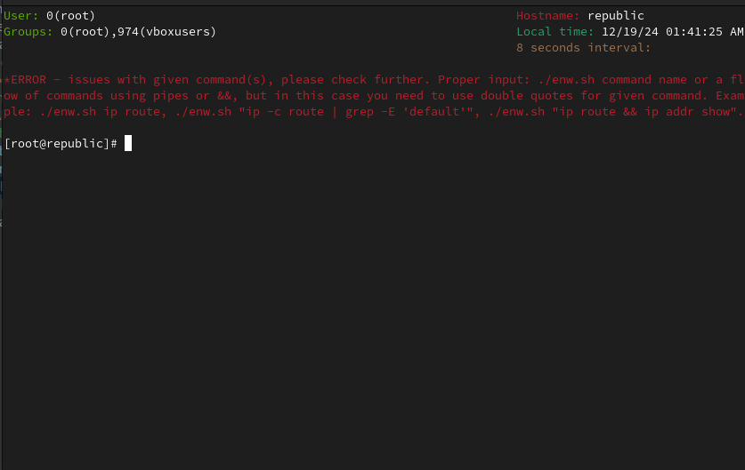
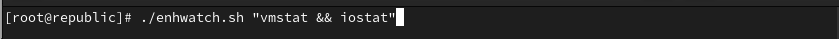
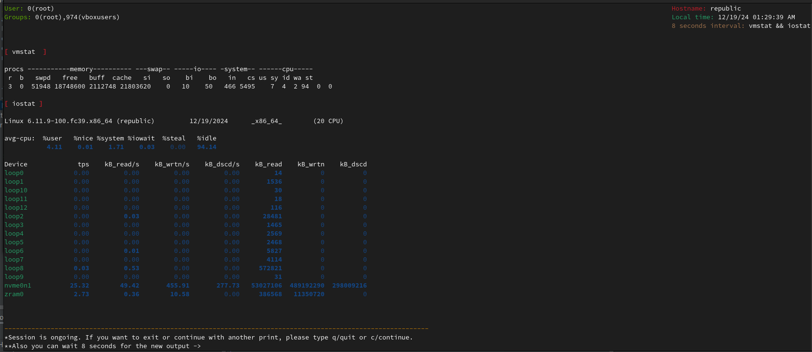
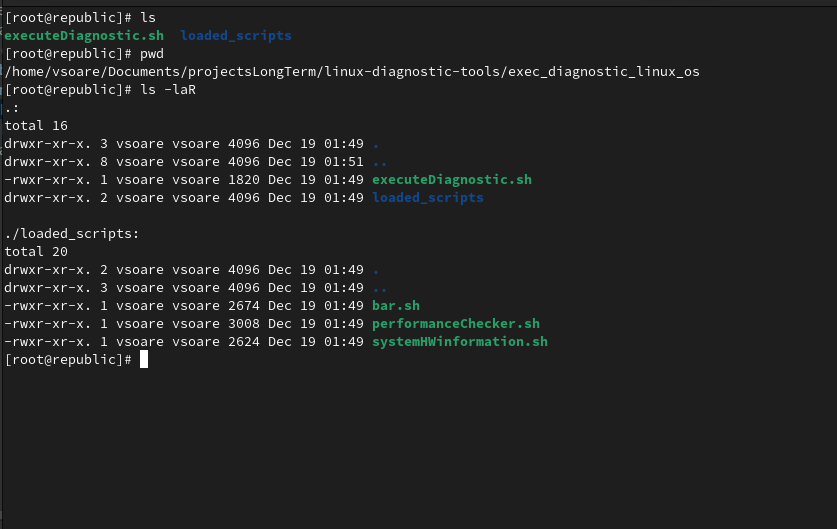
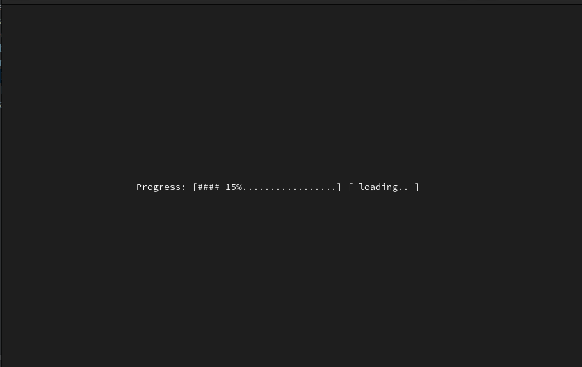
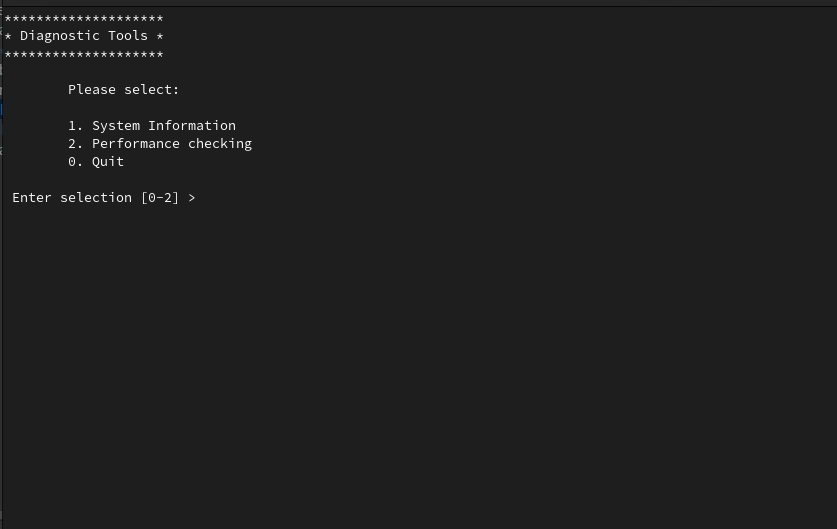
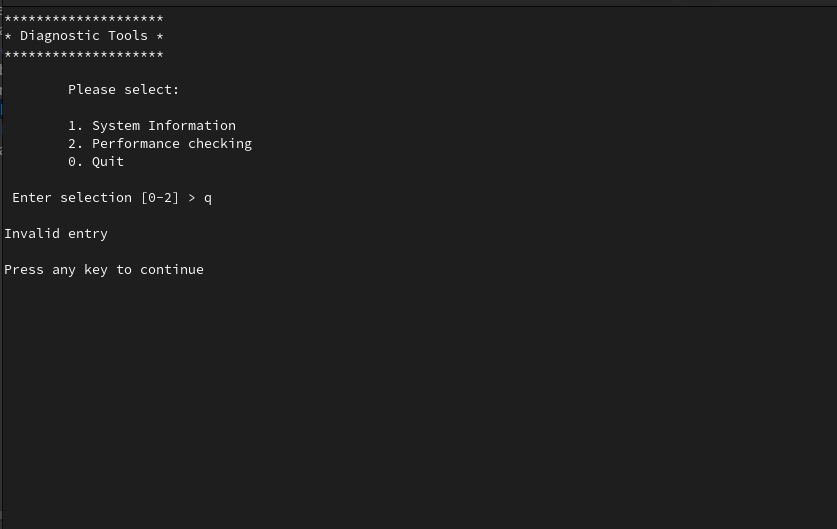
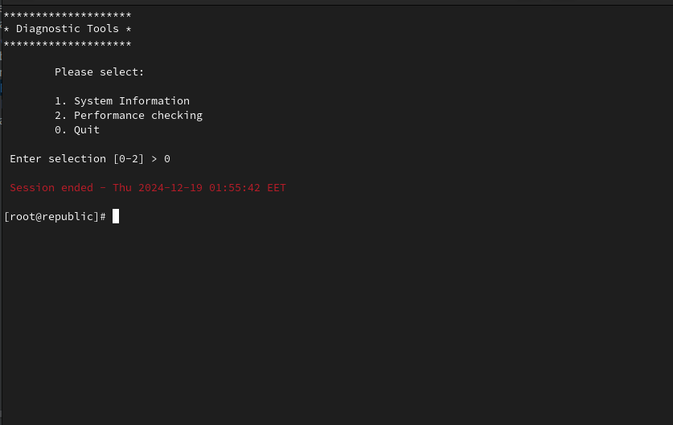

## 🐧 Linux Diagnostic Tools

**Welcome to the Linux Diagnostic Tools repository!** 🎉

This collection of bash scripts is from *nix way of doing things without any third party helper tool and it's a go-to solution for diagnosing performance issues on Linux systems. Whether you're a devops engineer, developer, or tech enthusiast, these scripts from the world of layer 3 OS support will help you optimize your system's performance. ⚙️💻

### 📚 Scripts included in the collection:

1. [x] app_status_checker - Application status checker if an app is installed or not. Tool is made to run from a CLI but with graphical aspects in mind;
2. [x] enhanced_watch - Enhanced Watch a replica with improvements of "watch" tool from linux. Multiple commands can be executed at the same time;
3. [x] exec_diagnostic_linux_os - Execute Diagnostic Linux OS performance commands like vmstat, iostat, etc;

### 🔖 **Collection of scripts**

1. ✅ **Application status checker**

Script used for checking if a tool is installed or not. When script is checking for the package designated for the application that we search for and then it is checked if that package is installed or not and also the version of that package.

* [x] All tools that we searched for are installed

 

* [x] Not all tools are installedREADME

 

2. 👀️ **Enhanced Watch**

This is a "watch" tool from Linux replica but with more features and an interactive way of working with this script.

* [x] Help output in case the command is executed in a wrong way.

 

* [x] How to execute the command, an example.

 

* [x] Enhanced Watch command in execution.

 

3. 👨‍💻 Execute Diagnostic Linux OS

A script for executing several commands for performance checking and presenting the result in a nicely fashion. Also interaction with this script is dinamic, from a menu. Also loading the script effect is in place when starting it.

* [x] Script directory structure

 

* [x] Loading script effect

 

* [x] Diagnostic Liwnux OS menu

 

* [x] Invalid key pressed

 

* [x] Exiting script

 

### ✉️ Contact

For any inquiries, please contact me www.linkedin.com/in/valentin-soare

